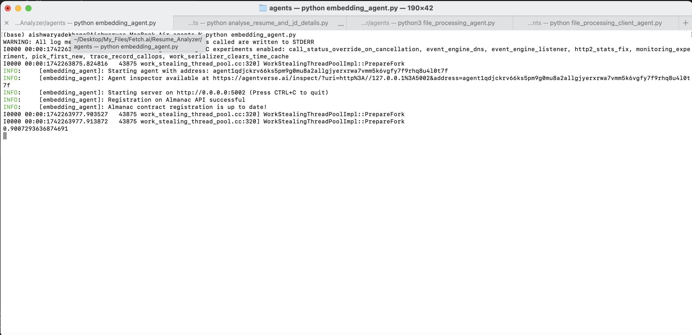

# Agent Name: Embedding_Agent

## Description
The `embedding_agent` is designed to process job descriptions and resume files, generate their embeddings using OpenAI's text-embedding-ada-002 model, and compute similarity scores to assess how well a resume matches a job description. The agent operates asynchronously and communicates with a client agent to send similarity results.

## Input Data Model
The agent expects input data in the form of a `FileProcessingRequest` model:

```python
class FileProcessingRequest(Model):
    file_content: str  # Base64-encoded file content
    file_type: str
    job_description: str
    jd_type: str
```

## Output Data Model
The agent responds with similarity computation results in the `FileProcessingResponse` model:

```python
class FileProcessingResponse(Model):
    extracted_text: str
    similarity: float
```
## Screenshots
### Terminal Output


## Features
- Processes resumes and job descriptions to generate embeddings.
- Computes similarity between job descriptions and resumes using cosine similarity.
- Uses OpenAI's `text-embedding-ada-002` model.
- Communicates results asynchronously with a client agent.
- Implements basic text preprocessing to clean and normalize input text.

## Dependencies
The project requires the following dependencies:
- `uagents`
- `openai`
- `json`
- `scikit-learn`

## Installation
To install the required dependencies, run:

```sh
pip install uagents openai scikit-learn
```

## Functions

### `preprocess_text(text: str) -> str`
Preprocesses the given text by:
- Removing extra spaces.
- Stripping special characters.
- Converting to lowercase.

### `handle_embedding(ctx: Context, sender: str, request: FileProcessingRequest)`
Handles incoming file processing requests by:
- Generating embeddings using OpenAI's text-embedding-ada-002 model.
- Computing cosine similarity between the resume and job description embeddings.
- Sending the computed similarity score to the client agent.

## Usage
1. Ensure the OpenAI API key is set correctly.
2. Start the agent by running:

   ```sh
   python embedding_agent.py
   ```

3. The agent listens for incoming file processing requests and responds with similarity scores.

## Author
Aishwarya Dekhane

