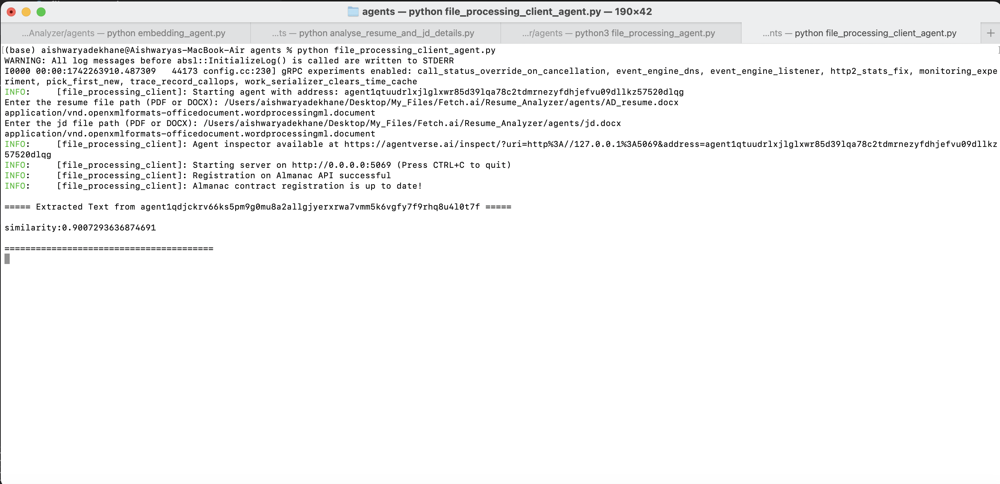

# Agent Name: File_Similarity_Score_Calculator

## Description
The **file_processing_client** agent is responsible for sending resume and job description files (PDF or DOCX) to the file processing server agent. It encodes the files in Base64, sends them for similarity analysis, and prints the similarity score received in response.

## Input Data Model
```python
class FileProcessingRequest(Model):
    file_content: str  # Base64-encoded file content
    file_type: str
    job_description: str
    jd_type: str
```
The input consists of a resume file and a job description file, both encoded in Base64, along with their respective file types.

## Output Data Model
```python
class FileProcessingResponse(Model):
    extracted_text: str
    similarity: float
```
The output contains the extracted text and the similarity score between the resume and job description.

## Features
- Reads PDF and DOCX files and encodes them in Base64.
- Sends encoded files to the server agent for similarity calculation.
- Receives and prints the similarity score between the resume and job description.

## Dependencies
- `uagents`
- `base64`
- `os`

## Installation
To install the necessary dependencies, run:
```bash
pip install uagents
```
## Screenshots
Here are some screenshots demonstrating the functionality of My Agent:
   

## Functions
```python
def read_file(file_path):
    """Reads the content of a PDF or DOCX file and encodes it as Base64."""
```
Reads and encodes a given file into Base64 format.

```python
@client_agent.on_message(model=FileProcessingResponse)
async def handle_response(ctx: Context, sender: str, msg: FileProcessingResponse):
```
Handles the response from the server agent and prints the similarity score.

```python
@client_agent.on_event("startup")
async def startup_handler(ctx: Context):
```
Handles the startup event, prompting the user to enter file paths and sending the request to the server agent.

## Usage
1. Run the script:
   ```bash
   python script_name.py
   ```
2. Enter the file path for the resume and job description when prompted.
3. The agent sends the files to the server agent and prints the similarity score received in response.

## Author
Aishwarya

