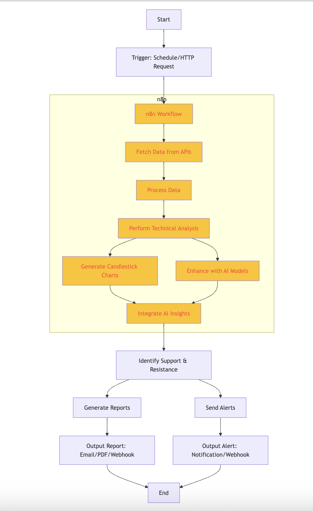
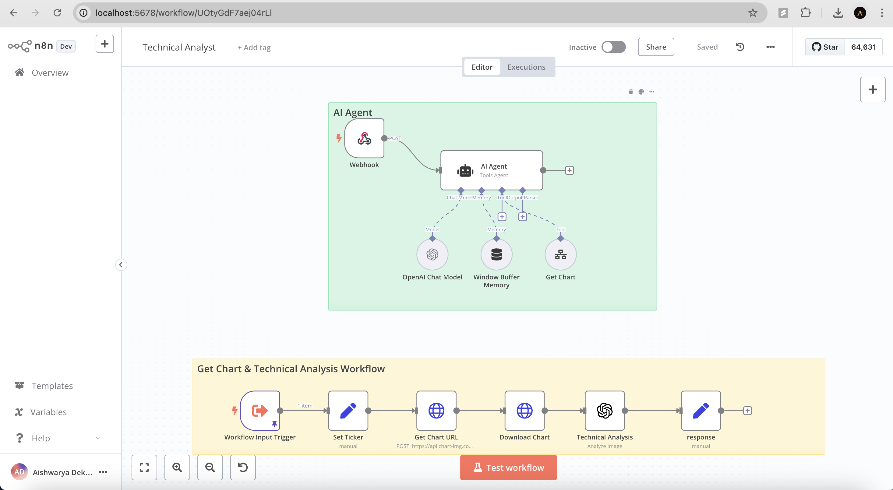
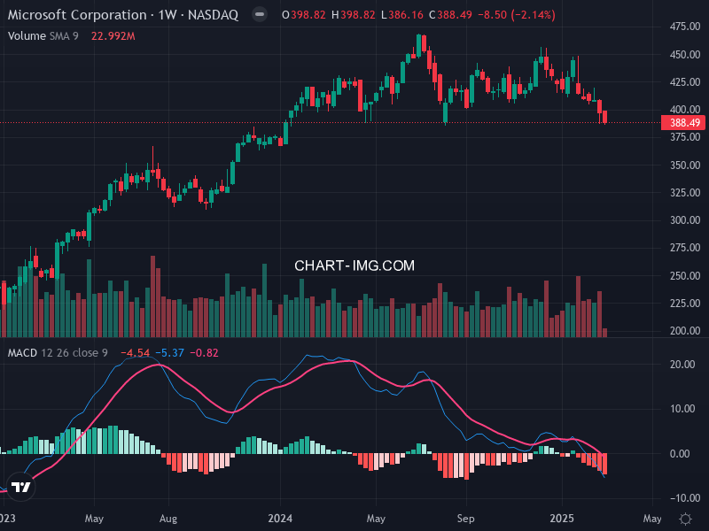

# Agent Name: Technical Analyst

## Description
This project is designed to create a Technical Analysis Agent for Bitcoin, leveraging technical indicators like RSI and DMI to provide insights into market conditions. It generates visually appealing charts with candlestick patterns and volume data, utilizing AI models for enhanced analysis.

## Input Data Model
The expected input data format includes real-time and historical Bitcoin market data:
```python
class InputData:
    def __init__(self, timestamp, open_price, high_price, low_price, close_price, volume):
        self.timestamp = timestamp
        self.open_price = open_price
        self.high_price = high_price
        self.low_price = low_price
        self.close_price = close_price
        self.volume = volume
```

## Output Data Model
The output data format includes analytical results and visualization:
```python
class OutputData:
    def __init__(self, chart, rsi_value, dmi_value, support_levels, resistance_levels):
        self.chart = chart
        self.rsi_value = rsi_value
        self.dmi_value = dmi_value
        self.support_levels = support_levels
        self.resistance_levels = resistance_levels
```
## Screenshots
### Integration Flow


### N8N Workflow


### Stock Analysis


## Features
- Real-time data analysis for Bitcoin
- Technical indicator calculations (RSI, DMI)
- Generation of candlestick charts with volume data
- AI-enhanced insights using OpenAI models
- Automated alerts for key support and resistance levels

## Dependencies
Please install the following dependencies:
```bash
pip install -r requirements.txt
```

## Installation
To install the necessary dependencies and run the project, follow these steps:

1. Install Python 3.x if it's not already installed.
2. Ensure you have pip for package management.
3. Install the required packages:
   ```bash
   pip install -r requirements.txt
   ```
   (Ensure to list these packages in `requirements.txt` based on your imports at the top of the Python file.)

## Functions
The project includes the following primary functions:
{functions_str}

## Usage
To use the project, follow these steps:

1. Clone the repository:
   ```bash
   git clone [repository-url]
   cd [repository]
   ```
2. Run the main script:
   ```bash
   python {main_script}.py
   ```
3. Follow on-screen instructions for analysis results.

## Author
Aishwarya Dekhane

