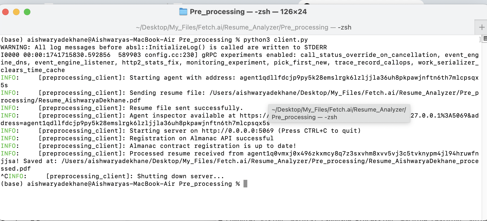
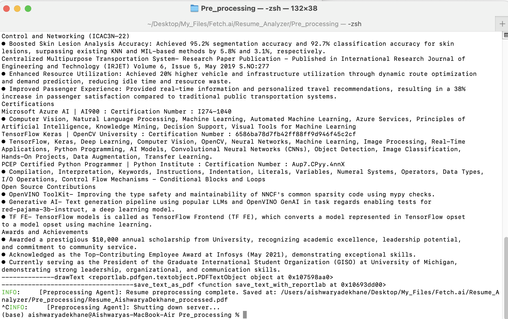

## Agent Name: Preprocessing_Agent

## Description
The **Preprocessing Agent** is designed to handle document ingestion, extract structured data from resumes (PDF/DOCX), and prepare text for downstream NLP tasks. It ensures efficient data normalization, tokenization, and transformation for advanced linguistic analysis.

## Input Data Model
```python
class ResumeRequest:
    def __init__(self, file_path: str):
        self.file_path = file_path
```

## Output Data Model
```python
class ProcessedResume:
    def __init__(self, extracted_text: str, structured_data: dict):
        self.extracted_text = extracted_text
        self.structured_data = structured_data
```

## Features
- **File Parsing**: Supports **PDF, DOCX** formats
- **Optical Character Recognition (OCR)**: Extracts text from scanned documents
- **Structured Data Extraction**: Identifies key sections (education, experience, skills)
- **Message Handling via gRPC**: Seamless inter-agent communication
- **Error Handling & Logging**: Robust exception handling for reliability

## Dependencies
```bash
pip install pdfplumber python-docx pytesseract grpcio protobuf
```

## Screenshots
### Terminal Command for Preproceesing Agent


### Terminal Command for Client Agent


## Installation
```bash
git clone <repo-url>
cd Resume_Analyzer
pip install -r requirements.txt
python3 pre_processing.py
```

## Functions
```python
async def startup_handler(ctx: InternalContext):
    """Prompts user for file path and initiates preprocessing."""

async def process_resume(file_path: str) -> ProcessedResume:
    """Reads resume file, extracts text, and structures key information."""
```

## Usage
Run the agent and provide a resume file path when prompted:
```bash
python3 pre_processing.py
python3 client.py
```

## Author
**Aishwarya Dekhane**

